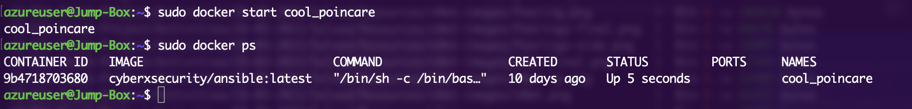
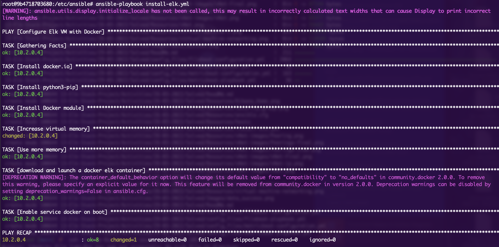

## Automated ELK Stack Deployment

The files in this repository were used to configure the network depicted below.

These files have been tested and used to generate a live ELK deployment on Azure. They can be used to either recreate the entire deployment pictured above. Alternatively, select portions of the each Ansible configuration and playbook files may be used to install only certain pieces of it, such as Filebeat.

**Config files**
- [Ansible](Files/ansible.cfg)
- [Hosts](Files/hosts)
- [Filebeat](Files/filebeat-config.yml)
- [Metricbeat](Files/metricbeat-config.yml)

**Playbooks**
- [DVWA](Files/pentesting.yml)
- [ELK](Files/install-elk.yml)
- [Filebeat](Files/filebeat-playbook.yml)
- [Metricbeat](Files/metricbeat-playbook.yml)

This document contains the following details:
- Description of the Topology
- Access Policies
- ELK Configuration
  - Beats in Use
  - Machines Being Monitored
- How to Use the Ansible Build

### Description of the Topology

The main purpose of this network is to expose a load-balanced and monitored instance of DVWA, the D*mn Vulnerable Web Application.

Load balancing ensures that the application will be highly available by distributing the incoming traffic to the network. This offers some protection against DDoS attacks, and optimization of server response times. The Load Balancer is only accessible via `http` through port 80.

Having a load balancer and a jump box allows for segmentation of authentification by separating the `http` requests to the servers from their administration accessible only through `ssh`. This offers a better security of the web servers. 

Integrating an ELK server allows users to easily monitor the vulnerable VMs for changes to the network and system logs (Filebeat) and system metric (Metricbeat). Elasticsearch then indexes the raw logs then visalized with Kibana.

The configuration details of each machine may be found below.

| Name          | Function             | IP Address (public) | IP Address (private) | Operating System |
|---------------|----------------------|---------------------|----------------------|------------------|
| Jump Box      | Gateway              | 20.211.105.11       | 10.0.0.4             | Linux (Debian)   |
| Load Balancer | Traffic distribution | 20.92.234.60        | N/A                  | Linux (Debian)   |
| Web Server 1  | Hosting DVWA         | (Load Balancer)     | 10.0.0.6             | Linux (Debian)   |
| Web Server 2  | Hosting DVWA         | (Load Balancer)     | 10.0.0.7             | Linux (Debian)   |
| ELK-vm        | Hosting ELK          | 51.13.90.70         | 10.2.0.4             | Linux (Debian)   |

### Access Policies

The machines on the internal network are not exposed to the public Internet. 

Only the load balancer can accept connections from the Internet through `http`. Access to it is only allowed through port 80. All IP addresses are allowed access however, which is not ideal security but does permit the use of vpn and changing access locations.

Machines within the network can only be accessed by the jump box, itself only accessible via `ssh` through port 22.

A summary of the access policies in place can be found in the table below.

| Name                               | Publicly Accessible        | Allowed IP addresses | SSH key |
|------------------------------------|----------------------------|----------------------|---------|
| Jump Box                           | only through `ssh`         | any                  | yes     |
| Load Balancer                      | yes (only through `http`)  | any                  | no      |
| web servers (1 & 2)                | only through Load Balancer | N/A                  | yes     |
| ELK                                | yes                        | any                  | no      |
| traffic outside of ports 22 and 80 | no                         | none                 | no      |

### Elk Configuration

Ansible was used to automate configuration of all of the virtual machines. This allows the same configuration to be rolled out to different machines (eg. web server 1 and 2) automatically. Similarely, in a single playbook, mutliple configurations can be rolled out to different sets of machines using groups (eg. webserver vs elk).

No configuration was performed manually, which is advantageous because it reduces errors, especially regarding dependencies. The playbook format is very strict and each command has only a few possible options.

The ELK playbook implements the following tasks, in order of execution:
- install `docker.io`
- install `python` 3
- pip install the `docker` module
- use the `sysctl` to increase memory (and virtual memory) allocation 
- download and launch the `elk` container
- enable the service docker on boot, ensuring persistance through reboots

The following screenshot displays the result of running `docker ps`: it lists the dockers currently started.:

Successfully configuring and running a playbook should look something like this:

### Target Machines & Beats
This ELK server is configured to monitor both web servers. We have installed the following Beats on these machines:
- Filebeat
- Metricbeat
Both are *lightweight shipper[s] for forwarding and centralizing log data.*

These Beats allow us to collect the following information from each machine:
- **Filebeat** *monitors the log files or locations that you specify, collects log events*
- **Metricbeat** *periodically collect metrics from the operating system and from services running on the server.*

Both then ship the outputs to Elasticsearch, then passed to Kibana for easy viewing and analysis.
(sources: [filebeat](https://www.elastic.co/guide/en/beats/filebeat/current/filebeat-overview.html) and [metricbeat](https://www.elastic.co/guide/en/beats/metricbeat/current/metricbeat-overview.html))

### Using the Playbook
In order to use the playbook, you will need to have an Ansible control node already configured. Assuming you have such a control node provisioned: 

SSH into the control node and follow the steps below:
- Copy or download the config and playbook files above to `/etc/ansible/`.
- Update the `hosts` and config files to include the correct private IP addresses for your network.
- Run the playbooks `sudo ansible-playbook <playbookname>.yml`, and navigate to `http://<ELK public IP>:5601/app/kibana` in your browser to check that the installation worked as expected.
